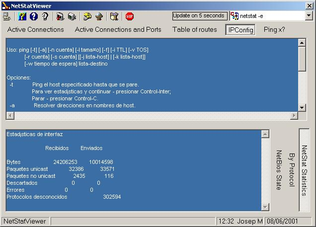



## NetStat Viewer

### Description

Netstat viewer execute netstat, nbtstat, ipconfig, ping console commnads and returns the results into visual basic on windows forms
 
### More Info
 
Net viewer is a serial of API calls to execute the process for console commands and return it to vb windows form. The application can be configurated. Netstat viewer can show each second the netstat statistics.

             |
---                |---
**Submitted On**   |2001-06-08 12:24:34
**By**             |[Jose Miguel Torres](https://github.com/Planet-Source-Code/PSCIndex/blob/master/ByAuthor/jose-miguel-torres.md)
**Level**          |Advanced
**User Rating**    |4.5 (54 globes from 12 users)
**Compatibility**  |VB 6\.0
**Category**       |[Complete Applications](https://github.com/Planet-Source-Code/PSCIndex/blob/master/ByCategory/complete-applications__1-27.md)
**World**          |[Visual Basic](https://github.com/Planet-Source-Code/PSCIndex/blob/master/ByWorld/visual-basic.md)
**Archive File**   |[NetStat Vi20795682001\.zip](https://github.com/Planet-Source-Code/jose-miguel-torres-netstat-viewer__1-23882/archive/master.zip)

